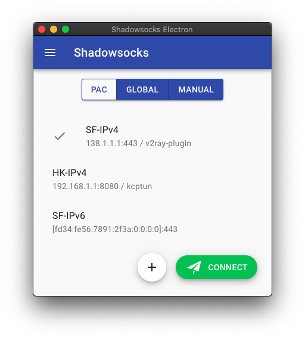

# Shadowsocks Electron

Shadowsocks GUI with cross-platform desktop support based on Electron ⚛️, made specially for Linux users.

## Downloads

- Bintray

  

- GitHub Releases

  

## Why?

- [`shadowsocks/shadowsocks-qt5`](https://github.com/shadowsocks/shadowsocks-qt5) has been deprecated.
- Only [`Shadowsocks-libev`](https://github.com/shadowsocks/shadowsocks-libev) and [`Shadowsocks for Android`](https://github.com/shadowsocks/shadowsocks-android) support ACL (bypass China IPs, etc.)
- I am lazy. I want an out-of-the-box App which handles proxy setup easily, even on Linux desktops.

This project was heavily inspired by [shadowsocks/ShadowsocksX-NG](https://github.com/shadowsocks/ShadowsocksX-NG), which uses local Shadowsocks-libev binary to avoid complex integration with native C code. This means it can always use the latest Shadowsocks-libev version.

It also uses Electron to bring the most powerful cross-platform desktop support with great developing experience.

## Features

- AEAD ciphers
- PAC mode (GFWList)
- Global mode (socks proxy)
- Manual mode (no system-wide proxy set)
- SIP003 plugins (v2ray & kcptun)

> WIP: Those features will be implemented soon.

- SIP002 URL import / QR code scan
- HTTP proxy
- ACL

## Supported Platforms

- Ubuntu (linux x64)
- macOS (darwin x64)
- Windows (windows x64)

> WIP: Other platforms or Linux distributions are coming soon.

## Credit

- [shadowsocks/shadowsocks-libev](https://github.com/shadowsocks/shadowsocks-libev)
- [shadowsocks/ShadowsocksX-NG](https://github.com/shadowsocks/ShadowsocksX-NG)
- [himanshub16/ProxyMan](https://github.com/himanshub16/ProxyMan)
